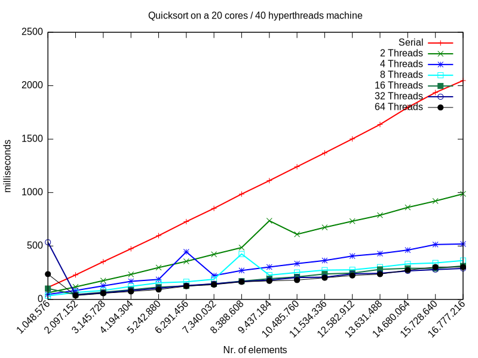

# Simple Quicksort Example

This repository contains a simple serial and parallelized Quicksort implementation in Java and some naive benchmarking with various integer arrays of increasing size.

## Benchmarking the implementation

``` console
$ java -Xmx12G -Xms12G -cp ./bin/ -DBASE_SIZE=1048576 -DPARALLEL=False io.simonis.QuickSort
Test finished
Warmup finished
1048576 112
2097152 229
3145728 353
4194304 474
5242880 597
6291456 728
7340032 852
8388608 986
9437184 1112
10485760 1242
11534336 1371
12582912 1502
13631488 1637
14680064 1797
15728640 1936
16777216 2048
$ java -Xmx12G -Xms12G -cp ./bin/ -DBASE_SIZE=1048576 -DPARALLEL=TRUE -DPARALLELISM=2 io.simonis.QuickSort
Size of ForkJoinPool: 2
Test finished
Warmup finished
1048576 62
2097152 117
3145728 176
...
$ java -Xmx12G -Xms12G -cp ./bin/ -DBASE_SIZE=1048576 -DPARALLEL=TRUE -DPARALLELISM=64 io.simonis.QuickSort
...
```


