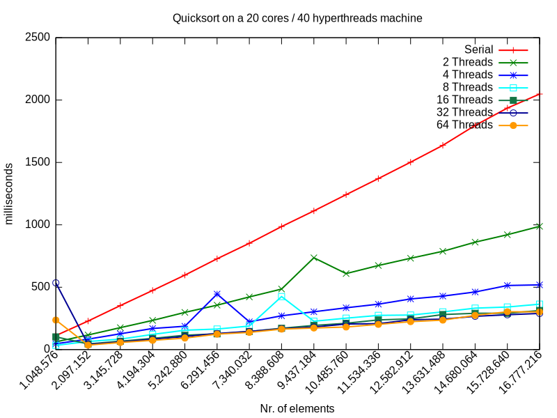

## Simple Quicksort Example

This repository contains a simple serial and parallelized [Quicksort](https://en.wikipedia.org/wiki/Quicksort) implementation in Java and some naive benchmarking with various integer arrays of increasing size.

The QuickSort algorithm in Java looks as follows:

```java
public static void quicksort(int[] a, int lo, int hi) {
  if (lo < hi) {
    int p = partition(a, lo, hi);
    quicksort(a, lo, p);
    quicksort(a, p+1, hi);
  }
}

public static int partition(int[] a, int lo, int hi) {
  int pivot = a[(lo + hi) / 2];
  while (lo <= hi) {
    while (a[lo] < pivot) lo++;
    while (a[hi] > pivot) hi--;
    if (lo <= hi) swap(a, lo++, hi--);
  }
  return lo - 1;
}
```

and is derived from the original version published by [C.A.R Hoare](https://en.wikipedia.org/wiki/Quicksort#Hoare_partition_scheme).

## Parallel Quicksort

The parallel version simply uses the standard Java [`Fork/Join`](https://docs.oracle.com/javase/tutorial/essential/concurrency/forkjoin.html) framework to parallelize the Quicksort algorithm:

```java
static class ParallelQuickSort extends RecursiveAction {
  final int[] a;
  final int lo, hi;
  // Array slices smaller than 'THRESHOLD' won't be sorted in parallel any more.
  final int THRESHOLD = Integer.getInteger("THRESHOLD", 256);

  public ParallelQuickSort(int[] a, int lo, int hi) {
    this.a = a;
    this.lo = lo;
    this.hi = hi;
  }

  @Override
  protected void compute() {
    if (hi - lo <= THRESHOLD) {
      quicksort(a, lo, hi);
    }
    else {
      int p = partition(a, lo, hi);
      invokeAll(new ParallelQuickSort(a, lo, p),
                new ParallelQuickSort(a, p+1, hi));
    }
  }
}

public static void quicksort_p(int[] a) {
  new ForkJoinPool().invoke(new ParallelQuickSort(a, 0, a.length - 1));
}
```

## Benchmarking the implementation

For benchmarking we setup a three-dimensional integer array filled with random numbers as follows:

```java
private static int[][][] setup() {
  System.gc();
  Random R = new Random();
  int[][][] ars = new int[ITERATIONS][][];
  for (int i = 0; i < ITERATIONS; i++) {
    ars[i] = new int[SAMPLES][];
    for (int j = 0; j < SAMPLES; j++) {
      ars[i][j] = new int[BASE_SIZE * (i + 1)];
      for (int k = 0; k < ars[i][j].length; k++) {
        ars[i][j][k] = R.nextInt();
      }
    }
  }
  return ars;
}
```

`ITERATIONS` is the number of different array sizes we will measure. `SAMPLES` denotes the number of measurements we will do for each array size. Finally, the different array sizes run from `BASE_SIZE` to `BASE_SIZE * ITERATIONS`. All these values can be configured by setting the corresponding java properties when invoking the program (see below).

``` console
$ java -Xmx12G -Xms12G -DBASE_SIZE=1048576 -DPARALLEL=False io.simonis.QuickSort
# Test finished
# Warmup finished
"Serial"
1.048.576 112
2.097.152 229
3.145.728 353
4.194.304 474
5.242.880 597
6.291.456 728
7.340.032 852
8.388.608 986
9.437.184 1112
10.485.760 1242
11.534.336 1371
12.582.912 1502
13.631.488 1637
14.680.064 1797
15.728.640 1936
16.777.216 2048
$ java -Xmx12G -Xms12G -DBASE_SIZE=1048576 -DPARALLEL=True -DPARALLELISM=2 io.simonis.QuickSort
# Test finished
# Warmup finished
# Using ForkJoinPool of size: 2
"2 Threads"
1048576 62
2097152 117
3145728 176
...
```

The output of the program is intend to be easily consumable by the attached [gnuplot](http://www.gnuplot.info/) script:

```Gnuplot
# usage: gnuplot -e "OUT_FILE='results.svg'" -e "IN_FILES='results_*.txt'" plot_results.gnuplot

if (!exists("IN_FILES")) IN_FILES="results_*.txt"
if (!exists("OUT_FILE")) OUT_FILE="results.svg"
if (!exists("TITLE")) TITLE="Quicksort on a 20 cores / 40 hyperthreads machine"

set terminal svg size 800,600
set output OUT_FILE
set title TITLE
set ylabel "milliseconds"
set xlabel "Nr. of elements"
set xtics rotate by 45 right
set decimal locale "de_DE.UTF-8"
set format x "%'g"

list = system("echo $(ls -v ".IN_FILES.")")
plot for [f in list] f using 2:xticlabels(1) with linespoints lw 2 title columnhead(1)
```

Finally, with all these ingredients, we can now easily create a graph which compares the Quicksort runtime for various array sizes and levels of parallelism:

```console
$ java -DBASE_SIZE=1048576 -DPARALLEL=False io.simonis.QuickSort > results_par1.txt
$ java -DBASE_SIZE=1048576 -DPARALLEL=True -DPARALLELISM=2 io.simonis.QuickSort > results_par2.txt
$ java -DBASE_SIZE=1048576 -DPARALLEL=True -DPARALLELISM=4 io.simonis.QuickSort > results_par4.txt
...
$ java -DBASE_SIZE=1048576 -DPARALLEL=True -DPARALLELISM=64 io.simonis.QuickSort > results_par64.txt
$ gnuplot -e "OUT_FILE='results.svg'" -e "IN_FILES='results_*.txt'" plot_results.gnuplot
```

This will result in a nice graph similiar to the following one:



The complexity of Quicksort looks nearly linear, it's true O(n*log(n)) nature can only been seen when looking at the exact numbers. Also, on my 20 core / 40 threads machine you can see that parallelization with the Fork/Join framework works pretty well. For 2 and 4 threads we get approximately half and a fourth of the initial runtime. Starting with 8 threads, the overhead of parallelization gets noticeable and starting with 32 threads we don't get any improvements any more (which is natural on a 20 core machine :)

## Customization properties

This program uses Java properties instead of command line arguments for configuration.

| `BASE_SIZE` | Base size of arrays to sort (i.e. smallest array will be of this size) |
| `ITERATIONS` | Number of different array sizes to sort. Sizes will range from `BASE_SIZE` to `ITERATIONS` * `BASE_SIZE` |
| `SAMPLES` | The number of measurements (i.e. array sorted) for each array size |
| `PARALLEL` | If `False` the serial version will be used, if `True` the parallel one |
| `PARALLELISM` | Sets the number of parallel sorting threads. If unset, the number will default to the number of CPUs (i.e. `Runtime.availableProcessors()`) |
| `THRESHOLD` | Array slices smaller than 'THRESHOLD' won't be sorted in parallel any more (defaults to 256). |
| `DEBUG` | If set to `True`, enables some extra debugging output |
